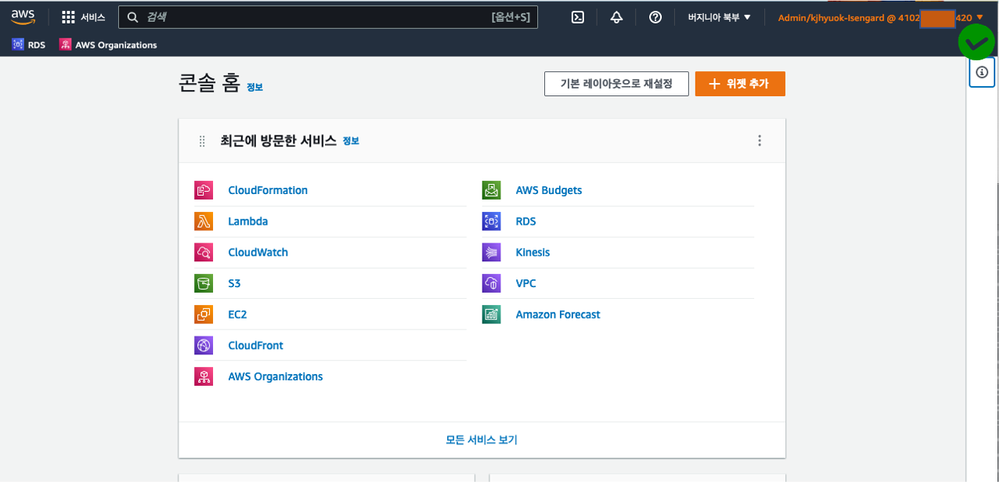
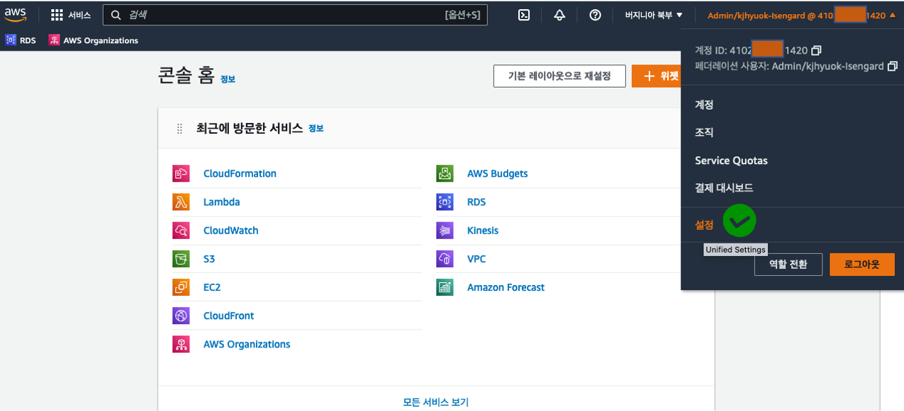
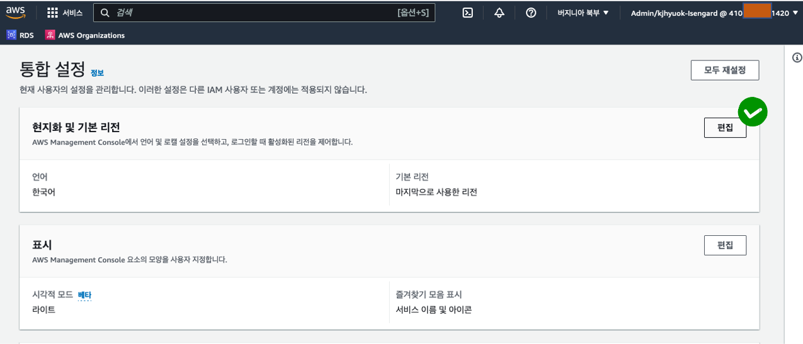
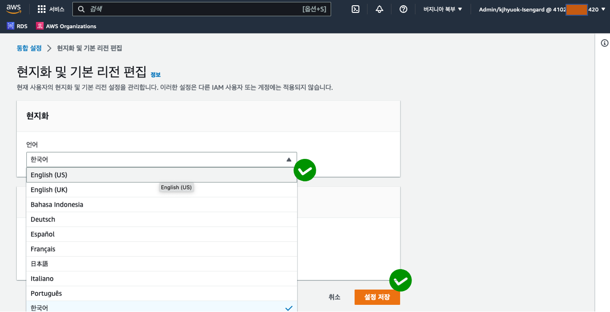
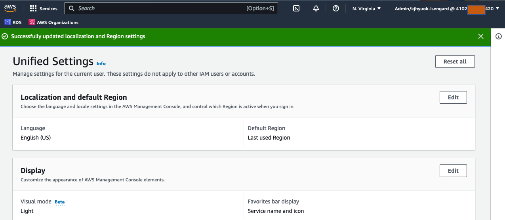
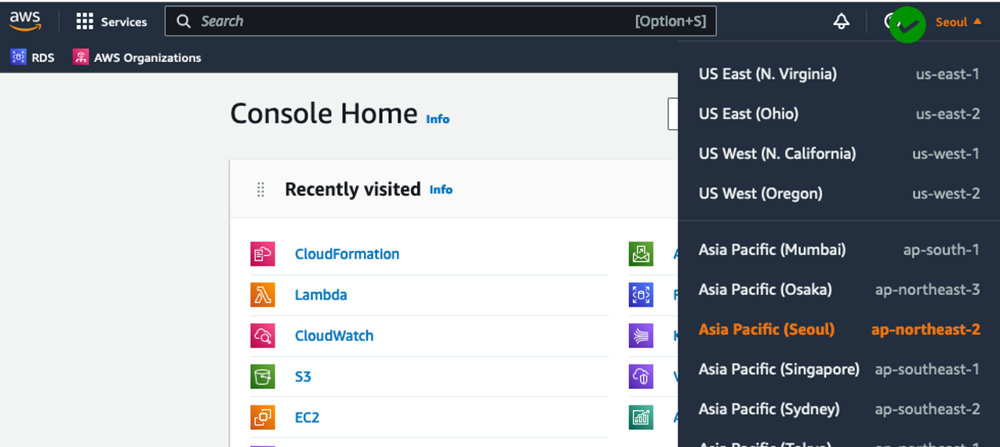
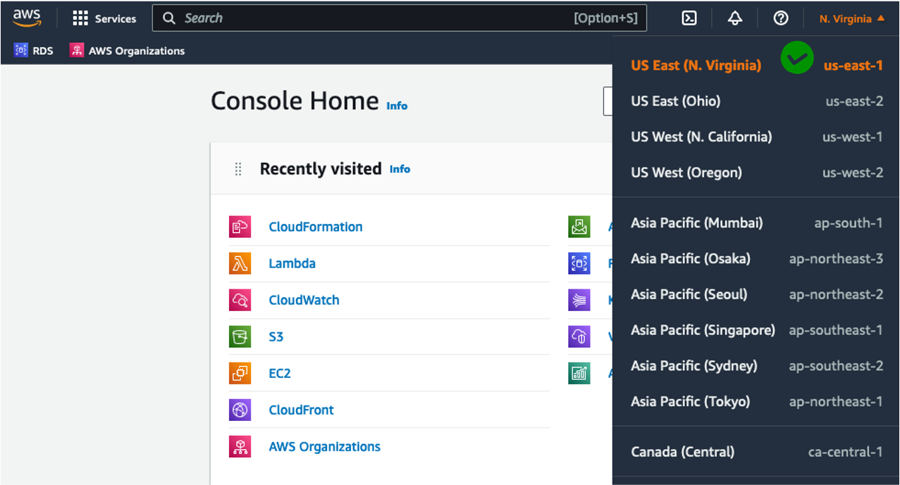

`이 페이지는 AWS에서 주최하는 교육에 참석하실 경우의 '실습 시작 전 준비 단계'를 안내합니다.`

* 영문으로 콘솔 변경하기  
AWS Web Console을 본 실습의 화면캡쳐 기준인 **Eng**로 설정합니다. 
만약 default page가 한글이라면, 다음과 같이 **Eng**으로 설정해 봅니다.

1. 우측상단의 Account ID(12자리) 선택.

2. 하단 메뉴에서 *설정* 선택

3. 통합 설정 메뉴에서 *편집* 선택

4. 언어 드롭 다운 메뉴에서 *Eng(US)* 선택 후 *설정 저장*

5. 언어변경이 완료 되었다면, 좌측 상단의 AWS 버튼으로 빠져 나옵니다.

영문으로 변경된 화면을 확인할 수 있습니다.

****
* 실습 region을 us-east-1: US East(N. Virginia) 설정하기  
본 실습의 region은 **N. Virginia**를 기준으로 제작되어 있습니다. 따라서 현재 진입한 region이 **N. Virginia**가 *아닌분들만 다음과 같이 region 설정을 부탁드립니다.

1. 우측 상단 region 정보 클릭

2. region 정보를 최상위 **N. Virginia** 선택

우측 상단메뉴에 region이 **N. Virginia** 으로 설정된 것을 확인할 수 있습니다.

