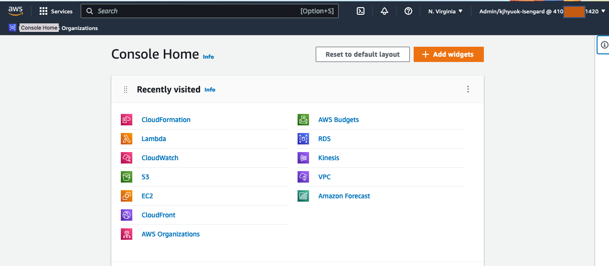

`이 페이지는 AWS에서 주최하는 교육에 참석하실 경우의 '실습 시작 전 준비 단계'를 안내합니다.`

**콘솔 환경**: AWS Web Console은 본 실습의 화면캡쳐 기준인 **Eng**로 설정합니다. 
만약 default page가 한글이라면, 다음과 같이 **Eng**으로 설정해 봅니다.

1. 우측상단의 Account ID(12자리) 선택.

2. 하단 메뉴에서 *설정* 선택

3. 통합 설정 메뉴에서 *편집* 선택

4. 언어 드롭 다운 메뉴에서 *Eng(US)* 선택 후 *설정 저장*

5. 언어변경이 완료 되었다면, 좌측 상단의 AWS 버튼으로 빠져 나옵니다.

