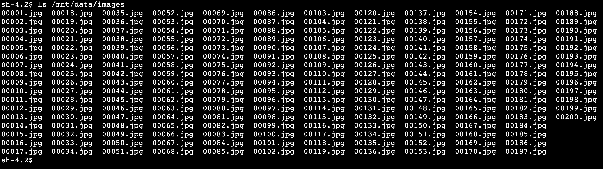

## Module 1 : On-premises 및 IN-CLOUD 리전에 실습용 AWS Resource 배포

Module 1에서는 CloudFormation 스크립트를 사용하여 두 개의 AWS 리전(On-premises 및 IN-CLOUD)에 리소스를 배포합니다.<br>
하나는 On-premises 환경을 나타내고 다른 하나는 CLOUD 내 환경을 나타내는데, 우선 모든 리소스가 배포되면 Application 서버의 NFS 서버에서 내보내기를 마운트하고 기존 파일을 확인합니다.


### Module Steps 
👉🏻*Storage 모든 실습을 us-east-1: US East(N. Virginia)에서 진행합니다.*
1. On-premises 리전에 대한 AWS 리소스 배포<br>
    a. 환경을 자동으로 배포하기 위해서 CloudFormation을 사용합니다. On-premises 리소스를 배포하려면 아래 표의 us-east-1: US East(N. Virginia)를 선택해주세요.<br>
    
|Region Code|Region Name|Launch|
|------|---|---|
|us-east-1|US East(N. Virginia)||

   1. 스택 생성 페이지에서 다음을 클릭합니다.
   2. 로컬 SSH 클라이언트를 사용하여 이 워크샵에서 생성된 EC2 인스턴스에 액세스하려면 선택한 리전에서 EC2 키 쌍의 이름을 입력하십시오. 그렇지 않으면 키 쌍을 비워 둘 수 있습니다.
   3. Next 클릭
   4. Next 클릭
   5. Next을 다시 클릭(옵션 및 고급 옵션 섹션 건너뛰기)
   6. review 페이지에서 아래로 스크롤하여 CloudFormation이 IAM 리소스를 생성함을 확인하는 확인란을 선택한 다음 스택 생성을 클릭합니다.
   
참고: 이 CloudFormation 템플릿의 일부로 시작된 인스턴스는 몇 분 동안 초기화 중 상태일 수 있습니다.<br>
자~ 이제 On-premises 리전에서 이 CloudFormation 배포가 진행되는 동안 IN-CLOUD 리전에 대한 리소스를 또 다른 CloudFormation으로 동시에 배포를 진행해 보시죠.

2. IN-CLOUD 리전에 대한 AWS 리소스 배포<br>
      a. 역시 실습 환경을 자동으로 배포하기 위해서 CloudFormation을 사용합니다. IN-CLOUD 리소스를 배포하려면 아래 표의 us-east-1: US East(N. Virginia)를 선택해주세요.<br>
      
|Region Code|Region Name|Launch|
|------|---|---|
|us-east-1|US East(N. Virginia)||

   1. 스택 생성 페이지에서 다음을 클릭합니다.
   2. Next 클릭(스택 parameters 없음).
   3. Next을 다시 클릭(옵션 및 고급 옵션 섹션 건너뛰기)
   4. review 페이지에서 아래로 스크롤하여 CloudFormation이 IAM 리소스를 생성함을 확인하는 확인란을 선택한 다음 스택 생성을 클릭합니다.

참고: 다음 단계를 진행하기 전에 각 리전의 CloudFormation 스택이 CREATE_COMPLETE 상태에 도달할 때까지 기다리십시오. 우리가 지금 실행 한 위의 2개 CloudFormation 스택이 완료되는 데 약 *10분*이 소요됩니다.

3. Stack Outputs<br>
완료되면 각 CloudFormation 스택에 "**Outputs**" 목록이 표시됩니다. IP Address 및 Resource Name과 같은 values는 이 실습 전체에서 사용되니 가급적 이런 Outputs values를 다른 곳에 복사하시고 실습을 진행하면서 활용하시면 좀 더 원활한 진행이 가능 합니다.<br>
On-premises 리전의 CloudFormation 페이지에서 아래 이미지와 같이 **Outputs** 탭을 클릭합니다.<br>
다음과 같은 4가지 값이 표시됩니다:
* **appServerPrivateIP** – Application 서버의 private IP 주소입니다. NFS 내보내기에 대한 액세스를 제한하기 위해 Storage Gateway file 공유를 생성할 때 이 옵션을 사용합니다.
* **dataSyncAgentPublicIP** – DataSync agent를 실행하는 EC2 인스턴스의 public IP 주소입니다. DataSync agent를 활성화할 때 사용합니다.
* **fileGatewayPublicIP** – File Gateway를 실행하는 EC2 인스턴스의 public IP 주소입니다. 이 옵션은 Storage Gateway를 활성화할 때 사용합니다.
* **nfsServerPrivateIP** – NFS 서버의 private IP 주소입니다. Application 서버와 DataSync 위치를 생성할 때 모두 사용합니다.


IN-CLOUD 리전의 CloudFormation 페이지에서 아래 이미지와 같이 **Outputs** 탭을 클릭하면 아래 그림과 같이 bucket관련 나열된 두 값(name/role)이 표시되어야 합니다.
* **bucketName** – 데이터가 복사될 S3 버킷의 이름입니다. Storage Gateway에서 file share를 생성할 때 이것을 사용합니다.
* **bucketRoleForDataSync** – DataSync agent가 S3 버킷에 파일을 쓰기 위해 사용하는 role입니다. DataSync에 대한 S3 location를 생성할 때 이것을 사용합니다.


4. Application server에 연결하기
    1. On-premises 리전의 AWS 콘솔에서 서비스를 클릭하고 **EC2**를 선택하고
    2. 왼쪽 메뉴에서 **Instance**를 선택합니다.
    3. Application Server 인스턴스를 마우스 오른쪽 버튼으로 클릭하고 메뉴에서 **Connect**을 선택합니다.
On-premises CloudFormation 템플릿을 배포할 때 EC2 Key Pair을 구성한 경우 컴퓨터에서 SSH 클라이언트를 사용하여 연결할 수 있습니다.


그렇지 않으면 **EC2 Instance Connect** 또는 **Session Manager**를 사용하여 브라우저를 통해 직접 인스턴스에 연결할 수 있습니다.


EC2 Instance Connect 또는 Session Manager를 사용하는 경우 **Connect**합니다. Application 서버에 대한 명령줄 인터페이스(CLI)와 함께 브라우저에서 새 탭이 열립니다. 실습과정에서 이 탭을 사용하여 CLI기반으로 작업해야 하니 열어 두세요.

### Validation Step
Application 서버용 CLI에서 다음 명령을 실행하여 NFS export를 마운트하고 NFS 서버에서 파일을 확인하세요.<br>
앞서 실행했었던 On-premises CloudFormation 스택 **Outputs**의 *nfsServerPrivateIP* 값을 사용합니다.

```
$ sudo mount -t nfs <nfs-server-ip-address>:/media/data /mnt/data
$ ls /mnt/data/images
 ```
/mnt/data/images 폴더에서 아래와 같이 200개의 이미지 파일을 볼 수 있는데 이런 이미지 파일은 AWS IN-CLOUD 리전의 S3 버킷으로 마이그레이션될 현재 On-premises의 NFS 서버내 데이터를 나타냅니다.


### Module1 Summary
Module1 에서는 On-premises 리전 및 IN-CLOUD 리전 양쪽에 오늘 실습을 완료하는 데 필요한 모든 AWS의 리소스를 Cloudformation을 통해 배포했습니다.
그리고 Application 서버에 NFS export를 마운트하고 약 200여개의 jpg 데이터 세트를 확인했는데요? 그렇다면 다음 모듈에서는 NFS 서버에서 S3 버킷으로 초기 파일 복사를 수행하는 DataSync 작업을 생성해 보겠습니다.

이제 환경구성을 마무리 하고, [Module2](../detail/module2.md)로 이동해 봅시다.
