# Module 2 : On-premises NFS를 AWS S3로 대체하기 위해 DataSync를 사용하여 현 스토리지를 마이그레이션 해 봅니다.

이 모듈에서는 On-premises 리전에 배포된 DataSync Agent를 활성화하고 DataSync location를 생성한 다음 Source location에서 Destination location로 데이터를 복사하는 DataSync 작업을 생성합니다.\
\
DataSync 작업은 데이터 복사 작업을 수행하며 **Source & Destination** 두 [**Location**](https://docs.aws.amazon.com/ko\_kr/datasync/latest/userguide/working-with-locations.html)이 필요합니다. DataSync에서 사용할 **Location**은 파일이 현재 저장되어 있거나 앞으로 복사 할 Endpoint 입니다. **Location**은 NFS, SMB, Amazon S3, HDFS, Fsx for Windows, Fsx for Lustre, Amazon EFS가 될 수 있습니다. **Location** object는 task와 독립적이며 단일 **Location**을 여러 task에 사용할 수 있습니다.

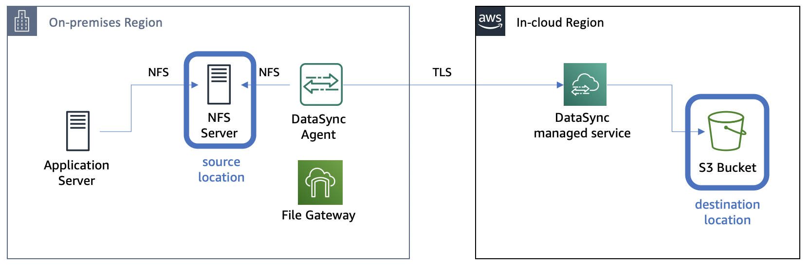

### Module Steps

👉🏻\_Storage 모든 실습을 us-east-1: US East(N. Virginia)에서 진행합니다.

1.  먼저 **Data Sync Agent의 활성화**\
    Agent Instance는 Module1에서 생성되었는데 사용하려면 **IN-CLOUD** 리전에서 활성화해야 합니다. Agent를 활성화하려면 아래 단계를 따르세요.

    1. AWS Management 콘솔 페이지로 이동하고 **Services**를 클릭한 다음 **DataSync**를 선택합니다.
    2. DataSync agent 생성을 위해 **Create agent** 버튼을 클릭합니다.(기존 생성된 agent가 있다면, **Get started**)
    3. DataSync agent를 실행할 EC2 인스턴스는 이미 **on-premises**를 시뮬레이션 하는 환경에 배포되었습니다.
    4. Deploy agent를 EC2 인스턴스로 선택해 주세요.

    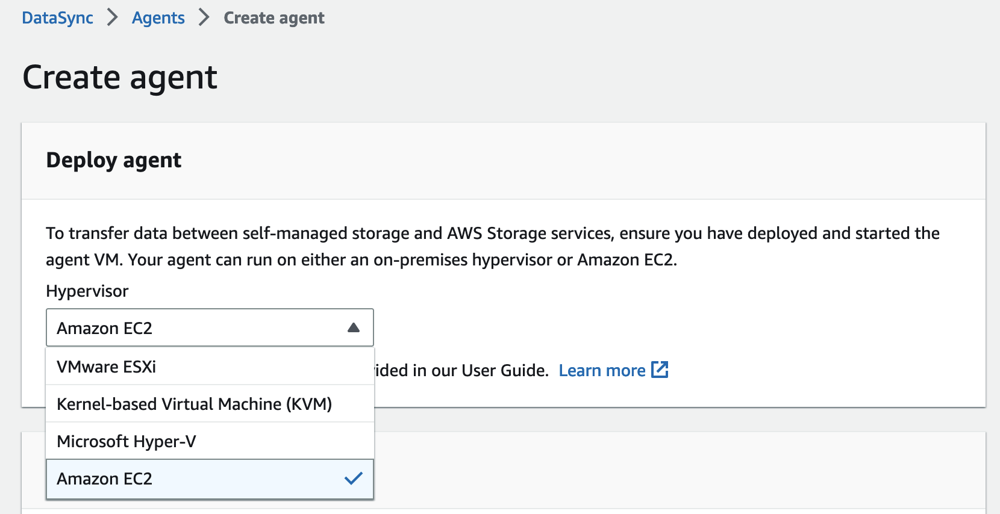

    5. 서비스 엔드포인트를 "**Public service endpoints**"로 둡니다.
    6. **Activation key** 섹션 아래에 On-premises 리전에서 실행 중인 DataSync agent 인스턴스의 **Public IP address**를 입력합니다. On-premises 리전의 **CloudFormation Outputs**에서 이 IP 주소를 가져올 수 있습니다. 활성화를 위해 웹 브라우저에서 agent에 액세스할 수 있어야 하므로 여기에서 **Public IP** 주소를 사용합니다. 아래와 같이 agent의 IP address를 입력하고 **Get key**를 클릭합니다.

    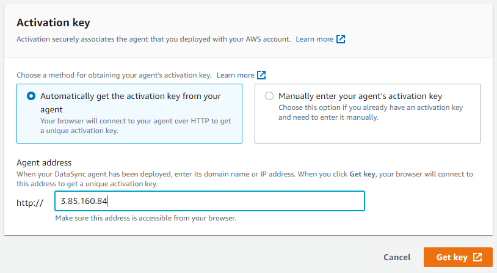

    7. 활성화에 성공하면 활성화 키가 표시되고 추가 정보를 입력하라는 메시지가 표시됩니다.

    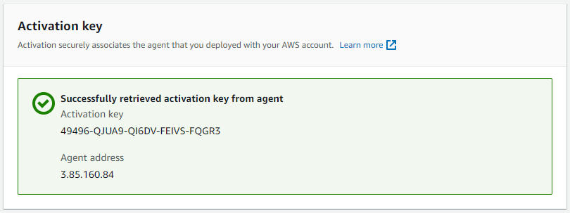

    8. 원하는 경우 agent 이름을 입력한 다음 **Create agent**를 클릭합니다.
2.  **Create NFS location**

    1. DataSync 서비스 페이지의 왼쪽에서 **Locations**를 클릭한 다음 **Create location**을 클릭합니다.
    2. On-premises NFS 서버의 location을 생성합니다. 위치 유형 드롭다운에서 **Network File System**을 선택합니다.
    3. agent 드롭다운에서 이전 단계에서 생성한 DataSync agent를 선택합니다.
    4. CloudFormation Outputs에서 따로 복사해 둔 NFS 서버의 **nfsServerPrivateIP**를 입력합니다. 이것은 이전 모듈에서 Application 서버에 NFS를 마운트하는 데 사용한 것과 동일한 IP 주소입니다. DataSync agent가 NFS를 마운트하는 데 사용할 IP address입니다.

    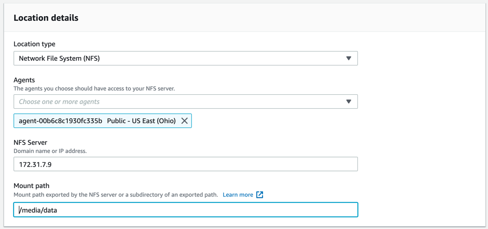

    Mount Path에는 모듈1에서 확인한 것처럼 200장의 이미지가 저장되어 있었던 아래를 넣어 주세요.

    ```
    /media/data
    ```

    5. Click **Create location**.
3.  **Create S3 location**

    1. DataSync 서비스 페이지의 왼쪽에서 **Locations** 클릭한 다음 **Create location**을 클릭합니다.
    2. S3 버킷의 location을 생성합니다. location 유형 드롭다운에서 **Amazon S3 bucket**을 선택합니다.
    3. S3 버킷 드롭다운에서 **data-migration-workshop**으로 시작하는 S3 버킷을 선택합니다.
    4. S3 스토리지 클래스를 **Standard**로 유지하시고
    5. 폴더 아래에 "/"를 입력합니다. 이렇게 하면 모든 파일이 버킷의 최상위 수준으로 복사됩니다.
    6. IAM roles에서 **DataMigrationWorkshop-inCloud**로 시작하는 S3 버킷 IAM roles을 선택합니다. roles의 전체 이름은 클라우드 내 CloudFormation 스택의 Outputs에서 찾을 수 있습니다.

    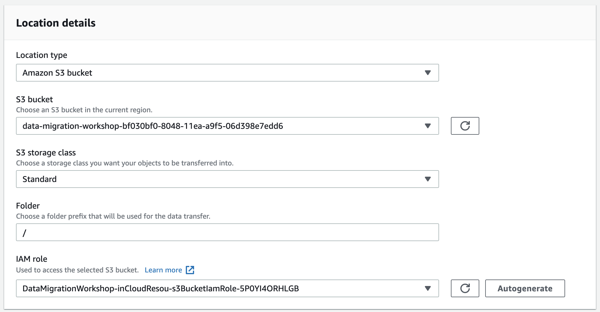

    7. Click **Create location**: 페이지 왼쪽에서 **Locations**를 다시 클릭합니다. 이제 두 개의 locations가 나열되는데 하나는 NFS 서버용이고 다른 하나는 S3 버킷용입니다.

    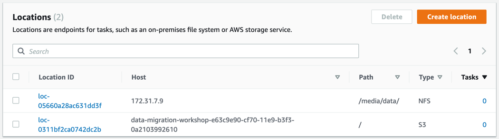
4.  **Create a task**

    1. DataSync 서비스 페이지의 왼쪽에서 **Tasks**를 클릭한 다음 **Create task**을 클릭합니다.
    2. _Source location option_에서 **Choose an existing location**을 선택합니다.
    3. _Existing locations_ 드롭다운에서 이전에 생성한 NFS 서버 location를 선택합니다.
    4. Click **Next**.

    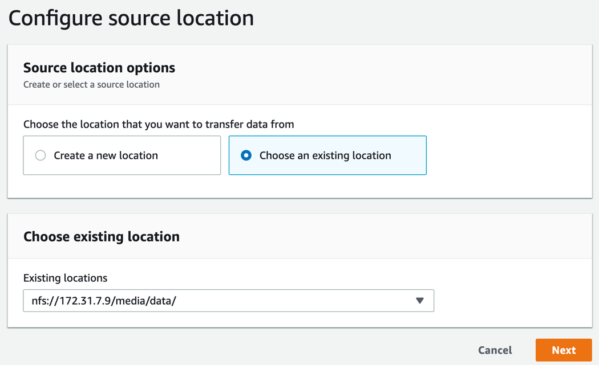

    5. _Destination location_ 옵션에서 **Choose an existing location**을 선택합니다.
    6. _Existing locations_ 드롭다운에서 이전에 생성한 S3 버킷 위치를 선택합니다.
    7. Click **Next**.
    8. Task Name에는 `StorageWorkshop`을 입력하시고 **Verify data** 드롭다운에서 **Verify only the data transferred**을 선택합니다.(다른 모든 옵션은 기본 유지)
    9. 작업 logging에서 _Autogenerate_을 선택하여 CloudWatch log group 및 리소스 정책을 생성합니다.

    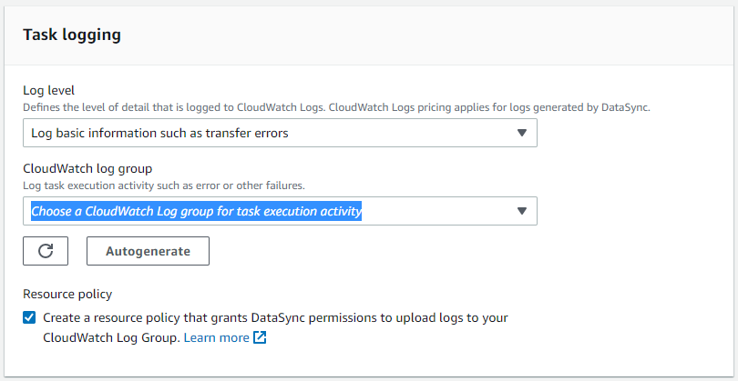

    10. 해당 작업 설정을 검토하고 **Create task**을 클릭합니다.
5.  **Run the task**

    1. **Task status**가 "_Available_"으로 보고될 때까지 기다립니다. (페이지를 refresh해야 할 수도 있습니다.)

    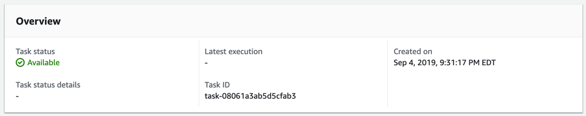

    2. 작업을 실행하려면 **Start**버튼을 클릭하고 **Start with defaults** 클릭합니다.
    3. 작업은 즉시 "_Running_" 상태로 전환됩니다.
    4. **History** 탭 아래 목록에서 task execution 개체를 클릭합니다.

    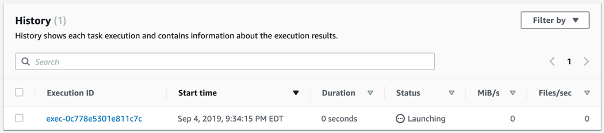

    5. 작업이 실행되면 실행 상태가 "_Launching_"에서 "_Preparing_", "_Transferring_", "_Verifying_", 마지막으로 "_Success_"로 진행됩니다. task execution은 아래와 같이 작업에 대한 통계를 보고합니다. 작업을 완료하는 데 몇 분 정도 걸립니다. 작업이 완료되면 202개의 파일이 전송되었음을 알 수 있습니다. 이것들은 우리가 지정한 path에 있는 2개의 폴더와 함께 데이터 세트에 있는 200개의 jpg 파일들 입니다.

    

    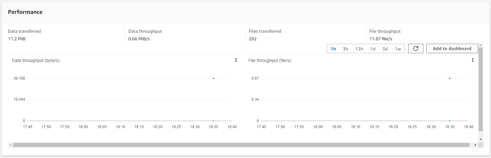

### Validation Step

AWS 콘솔에서 **S3**를 선택하고 버킷 목록에서 **data-migration-workshop** 버킷을 클릭합니다. 그 안에는 "_images_"라는 최상위 폴더가 표시되는데 이 폴더 안에는 NFS 서버의 .jpg 파일 200개가 있어야 합니다.

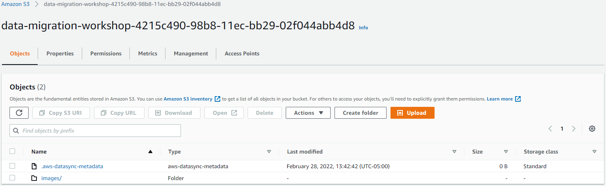

### Module2 Summary

이 모듈에서는 DataSync agent를 성공적으로 활성화하고 On-premises NFS 서버에서 AWS의 S3 버킷으로 파일을 복사하는 작업을 생성하고 그 파일이 성공적으로 복사되었는지 확인했습니다.

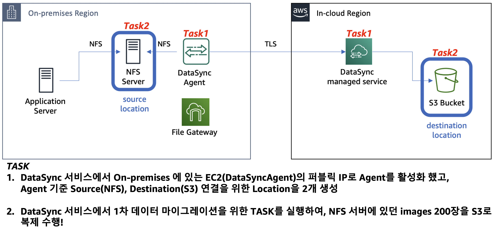

다음 [Module3](module3.md)에서는 On-premises 파일 게이트웨이를 생성해 보고 S3 버킷에 연결하여 NFS를 통해 AWS 클라우드 내의 파일에 액세스할 수 있도록 구성할 것입니다.

[Module3](module3.md)로 GoGo!👏
