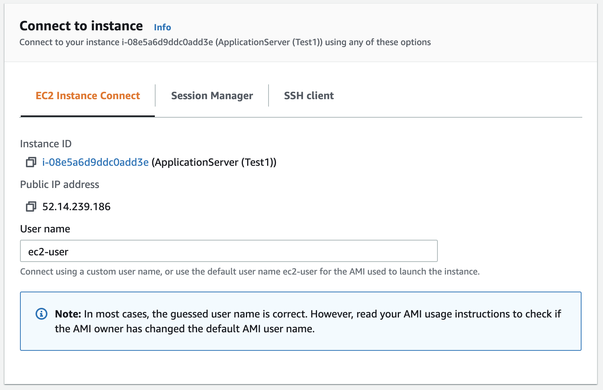

# Module 2 : DataSync를 사용하여 S3에 초기 파일 복사

이 모듈에서는 온프레미스 지역에 배포된 DataSync Agent를 활성화하고 DataSync location를 생성한 다음 Source location에서 Destination location로 데이터를 복사하는 DataSync 작업을 생성합니다.<br><br>
DataSync 작업은 데이터 복사 작업을 수행하며 **Source & Destination** 두 location이 필요합니다. DataSync에서 **location**는 파일이 상주하거나 복사될 Endpoint입니다. 위치는 NFS 내보내기, SMB 공유, Amazon S3 버킷, HDFS, Windows용 FSx, Lustre용 FSx 또는 Amazon EFS 파일 시스템일 수 있습니다.<br>
location object는 task와 독립적이며 단일 location을 여러 task에 사용할 수 있습니다.


### Module Steps (👉🏻*Storage 모든 실습을 us-east-1: US East(N. Virginia)에서 진행합니다.*)
***
1. 클라우드 배포영역에서 **Activate the DataSync agent**<br>
Agent Instance는 Module1에서 생성되었지만 사용하려면 클라우드 배포영역에서 활성화해야 합니다. Agent를 활성화하려면 아래 단계를 따르세요.<br>

    1. IN-CLOUD 리전의 AWS Management 콘솔 페이지로 이동하고 서비스를 클릭한 다음 DataSync를 선택합니다.
    2. DataSync 에이전트가 없으면 시작하기 버튼을 클릭하고 그렇지 않으면 에이전트 생성 버튼을 클릭합니다.
    3. DataSync 에이전트를 실행할 EC2 인스턴스는 이미 온프레미스 지역에 배포되었습니다.
    4. 서비스 엔드포인트를 "공용 서비스 엔드포인트"로 둡니다.
    5. 활성화 키 섹션 아래에 온프레미스 지역에서 실행 중인 DataSync 에이전트 인스턴스의 퍼블릭 IP 주소를 입력합니다. 온프레미스 지역의 CloudFormation 출력에서 이 IP 주소를 가져올 수 있습니다. 활성화를 위해 웹 브라우저에서 에이전트에 액세스할 수 있어야 하므로 여기에서 공용 IP 주소를 사용합니다. 아래와 같이 에이전트의 IP 주소를 입력하고 키 가져오기를 클릭합니다.
   
참고: 이 CloudFormation 템플릿의 일부로 시작된 인스턴스는 몇 분 동안 초기화 중 상태일 수 있습니다.<br>
자~ 이제 온프레미스 지역에서 이 CloudFormation 배포가 진행되는 동안 클라우드 내 지역에 대한 리소스를 또 다른 CloudFormation으로 동시에 배포를 진행해 보시죠.<br>

2. IN-CLOUD 리전에 대한 AWS 리소스 배포<br>
      a. 환경을 자동으로 배포하기 위해서 CloudFormation을 사용합니다. IN-CLOUD 리소스를 배포하려면 아래 표의 us-east-1: US East(N. Virginia)를 선택해주세요.<br>
   
|Region Code|Region Name|Launch|
|------|---|---|
|us-east-1|US East(N. Virginia)||

    1. 스택 생성 페이지에서 다음을 클릭합니다.
    2. Next 클릭(스택 parameters 없음).
    3. Next을 다시 클릭(옵션 및 고급 옵션 섹션 건너뛰기)
    4. review 페이지에서 아래로 스크롤하여 CloudFormation이 IAM 리소스를 생성함을 확인하는 확인란을 선택한 다음 스택 생성을 클릭합니다.

참고: 다음 단계를 진행하기 전에 각 리전의 CloudFormation 스택이 CREATE_COMPLETE 상태에 도달할 때까지 기다리십시오. 우리가 지금 실행 한 위의 2개 CloudFormation 스택이 완료되는 데 약 10분이 소요됩니다.<br><br>

3. Stack Outputs<br>
완료되면 각 Cloud Formation 스택에 "Outputs" 목록이 표시됩니다. IP 주소 및 리소스 이름과 같은 values는 워크샵 전체에서 사용됩니다. 그래서 가급적 이러한 values를 다른 곳에 복사하거나 브라우저에서 페이지를 열어 두고 워크샵을 진행하면서 복사해서 사용 할 수 있습니다.<br>
온프레미스 영역의 클라우드 형성 페이지에서 아래 이미지와 같이 출력 탭을 클릭합니다.<br>
다음과 같은 4가지 값이 표시됩니다:<br>
* **appServerPrivateIP** – Application 서버의 private IP 주소입니다. NFS 내보내기에 대한 액세스를 제한하기 위해 Storage Gateway file 공유를 생성할 때 이 옵션을 사용합니다.
* **dataSyncAgentPublicIP** – DataSync agent를 실행하는 EC2 인스턴스의 public IP 주소입니다. DataSync agent를 활성화할 때 사용합니다.
* **fileGatewayPublicIP** – File Gateway를 실행하는 EC2 인스턴스의 public IP 주소입니다. 이 옵션은 Storage Gateway를 활성화할 때 사용합니다.
* **nfsServerPrivateIP** – NFS 서버의 private IP 주소입니다. Application 서버와 DataSync 위치를 생성할 때 모두 사용합니다.


클라우드 내 지역의 CloudFormation 페이지에서 아래 이미지와 같이 Outputs 탭을 클릭하고 아래 그림과 같이 bucket관련 나열된 두 값(name/role)이 표시되어야 합니다.<br>
* **bucketName** – 데이터가 복사될 S3 버킷의 이름입니다. Storage Gateway에서 파일 공유를 생성할 때 이것을 사용합니다.
* **bucketRoleForDataSync** – DataSync 에이전트가 S3 버킷에 파일을 쓰기 위해 사용하는 역할입니다. DataSync에 대한 S3 위치를 생성할 때 이것을 사용합니다.


4. Application server에 연결하기<br>
    1. 온프레미스 지역의 AWS 콘솔에서 서비스를 클릭하고 **EC2**를 선택하고,
    2. 왼쪽 메뉴에서 **Instance**를 선택합니다.
    3. Application Server 인스턴스를 마우스 오른쪽 버튼으로 클릭하고 메뉴에서 **Connect**을 선택합니다.
온프레미스 CloudFormation 템플릿을 배포할 때 EC2 Key Pair을 구성한 경우 컴퓨터에서 SSH 클라이언트를 사용하여 연결할 수 있습니다.<br>


그렇지 않으면 EC2 Instance Connect 또는 Session Manager를 사용하여 브라우저를 통해 직접 인스턴스에 연결할 수 있습니다.


EC2 Instance Connect 또는 Session Manager를 사용하는 경우 연결을 **Connect**합니다. 응용 프로그램 서버에 대한 명령줄 인터페이스(CLI)와 함께 브라우저에서 새 탭이 열립니다. 실습과정에서 이 탭을 사용하여 CLI기반으로 작업해야 하니 열어 두세요.<br>

### Validation Step
***
Application 서버용 CLI에서 다음 명령을 실행하여 NFS export를 마운트하고 NFS 서버에서 파일을 확인하세요.<br>
앞서 실행했었던 온프레미스 CloudFormation 스택 **Outputs**의 nfsServerPrivateIP 값을 사용합니다.<br>

```
$ sudo mount -t nfs <nfs-server-ip-address>:/media/data /mnt/data
$ ls /mnt/data/images
 ```
/mnt/data/images 폴더에서 아래와 같이 200개의 이미지 파일을 볼 수 있는데 이런 이미지 파일은 AWS 클라우드 내 지역의 S3 버킷으로 마이그레이션될 현재 온프레미스의 NFS 서버내 데이터를 나타냅니다.<br>


### Module1 Summary
***
Module1 에서는 온프레미스 지역과 클라우드 내 지역 양쪽에 오늘 실습을 완료하는 데 필요한 모든 AWS의 리소스를 Cloudformation을 통해 배포했습니다.<br>
또한 Application 서버에 NFS export를 마운트하고 약 200여개의 jpg 데이터 세트를 확인했습니다.<br><br>
다음 모듈에서는 NFS 서버에서 S3 버킷으로 초기 파일 복사를 수행하는 DataSync 작업을 생성해 보겠습니다.

이제 환경구성을 마무리 하고, [Module2](../detail/module2.md)로 이동해 봅시다.

