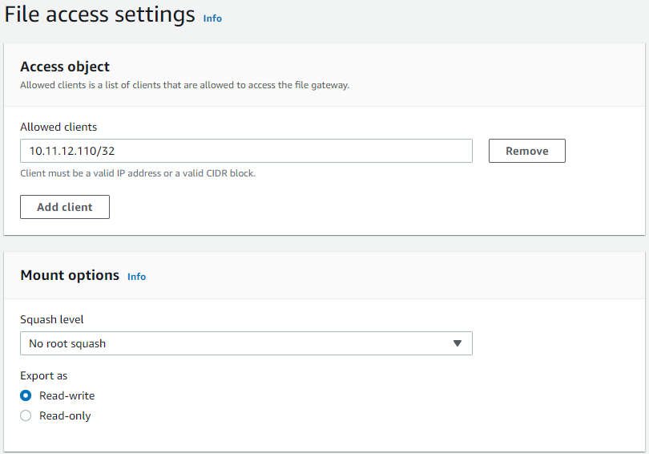

# Module 3 : Storage Gateway를 사용한 온프레미스 &rarr; AWS S3로의 액세스

이제 NFS 서버에서의 파일이 S3 버킷으로 복사되었습니다. 이 모듈에서는 CloudFormation에 의해 배포된 File Gateway를 구성하여 온프레미스 지역에서 S3 버킷과 연결하고 [**Storage Gateway**](https://aws.amazon.com/ko/storagegateway/) NFS share를 통해 S3 버킷의 파일에 접근할 수 있도록 액세스를 제공할 예정 입니다.<br>
Application 서버에서 **Storage Gateway** share를 마운트하여 파일에 대한 액세스를 확인해 봅시다.


### Module Steps (👉🏻*Storage 모든 실습을 us-east-1: US East(N. Virginia)에서 진행합니다.*)

1. **Activate the Storage Gateway**<br>
바로 전 Module2에서 DataSync agent를 활성화한 것처럼 Storage Gateway에 대해 비슷한 단계를 수행하여 IN-CLOUD 리전에서 활성화해야 합니다. 아래 단계를 따라서 진행합니다.

   1. IN-CLOUD 리전의 AWS Management 콘솔 페이지로 이동하고 **Services**를 클릭한 다음 **Storage Gateway**를 선택합니다.
   2. Gateway가 없으면 **Get started** 버튼을 클릭하고 그렇지 않으면 **Create gateway** 버튼을 클릭합니다.
   3. Gateway 이름을 "*DataMigrationGateway*"로 지정하고 **Amazon S3 File Gateway** 유형을 선택합니다.
   4. 호스트 플랫폼으로 **Amazon EC2**를 선택하고 게이트웨이 설정 확인을 선택한 후 **Next**를 클릭합니다.
   5. **Publicly accessible** endpoint 유형을 선택합니다.
   6. 앞서 Module1과정에서 CloudFormation을 사용해서 생성된 File Gateway instance의 **Public IP address**를 입력하고, **Next**를 클릭합니다.
   7. Gateway setting을 검토하고 **Next**를 클릭합니다.
   8. Gateway가 활성화된 다음 로컬 디스크 장치를 준비하는 데 1분 정도 소요됩니다. **300GiB /dev/sdc** 장치를 **Cache**에 할당합니다. 자주 액세스하는 파일을 캐시하는 데 사용할 Gateway의 로컬 디스크입니다.
   9. **CloudWatch log group** 패널에서 *Deactivate logging*를 선택하고 **Configure**을 클릭합니다.
   10. 기본 Storage Gateway 페이지에 *DataMigrationGateway*라는 이름의 Gateway가 표시됩니다.
   
   

2. **Create a Storage Gateway NFS share**

    1. **Create file share** 버튼을 클릭합니다.
    2. 방금 생성된 게이트웨이를 선택합니다.
    3. **Amazon S3 bucket name**에 DataSync가 파일을 복사한 S3 버킷의 이름을 입력합니다. 버킷 이름은 **IN-CLOUD** 리전의 CloudFormation 스택 *Outputs*에서 확인할 수 있습니다. **S3 prefix name**은 비워 둡니다.
    4. *Access objects using* 설정에서 **NFS**가 선택되어 있는지 확인합니다. **Automated cache refresh from S3**을 없음으로 설정합니다.
    5. Click **Next**.
    6. default S3 스토리지 설정을 유지한 후 **Next**를 클릭합니다.
    7. **Access object** 섹션에서 **Add client**를 클릭하고, Application 서버의 **Private IP Address**를 추가한 후 "/32"를 추가합니다. 이렇게 하면 Application 서버만 게이트웨이의 NFS 파일 공유에 액세스할 수 있습니다.
    
    
    
    8. **Mount options** 섹션에서 **Squash level**을 "*No root squash*"으로 변경합니다.
    9. Click **Next**.
    10. file share 설정을 검토하고 **Create**를 클릭합니다.
    11. new file share를 선택하고 mount 지침을 확인합니다.

    <br>

3. **Application 서버에 NFS share Mount**
    1. Application 서버에 대한 CLI로 돌아가서 아래 명령을 실행하여 Storage Gateway 공유에 대한 새 Mount 지점을 생성합니다.
    ```
    sudo mkdir /mnt/fgw
    ```
    2. Storage Gateway 파일 공유 페이지에서 Linux 탑재 명령을 복사하고 "[MountPath]"를 "/mnt/fgw"로 바꿉니다. **sudo로 명령을 실행해야 합니다.**
    3. 이제 애플리케이션 서버에 두 개의 NFS 마운트 지점이 있어야 합니다. 하나는 온프레미스 NFS 서버용(/mnt/data에 mounted)과 Storage Gateway용(/mnt/fgw에 mounted)입니다.
    ```
    mount | grep nfs4
    ```

    

### Validation Step

다음 명령을 실행하여 2 NFS shares에 동일한 파일 집합이 있는지 확인합니다.<br>
```
diff -qr /mnt/data /mnt/fgw
```
/mnt/fgw: .aws-datasync-metadata에 하나의 추가 파일만 표시되어야 합니다.<br>
이 파일은 작업이 실행될 때 S3 버킷의 DataSync에 의해 생성되었는데 다른 모든 파일은 동일하며 데이터가 오류 없이 DataSync에 의해 완전히 전송되었음을 나타냅니다.

### Module3 Summary

이 모듈에서는 성공적으로 Storage Gateway를 활성화하고 gateway에 NFS File share를 생성했습니다.<br>
그런 다음 Application 서버에 share를 마운트하고 On-premises NFS 서버의 파일이 S3 버킷에 올바르게 복사되었는지 확인했습니다.<br><br>
이 실습의 궁극적인 목표는 On-premises NFS 서버를 종료하고 스토리지 리소스를 확보하는 것인데, 프로덕션 환경에서 이것은 일반적으로 Application 서버가 새로운 스토리지로 전환될 때 일시적인 다운타임이 발생하는 "*cutover point*"을 포함하며 이 실습에서는 Storage Gateway NFS share 입니다.<br>
그러나 일반적으로 마이그레이션이 발생하는 동안 또는 그 직후에 생성되는 새 파일이 있으므로 컷오버 전에 또 다른 증분 파일 복사가 필요합니다.<br><br>
따라서 다음 모듈에서는 Storage Gateway share로의 최종 컷오버 전에 증분 복사를 한 번 더 수행합니다.

[Module4](../detail/module4.md)로 GoGo!👏

