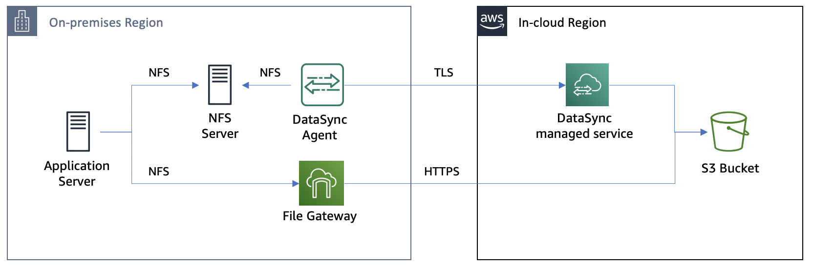
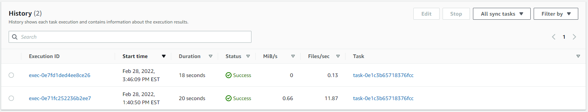
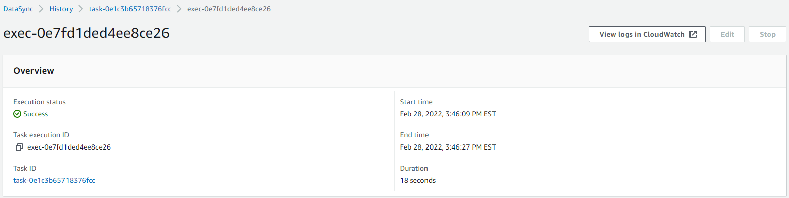
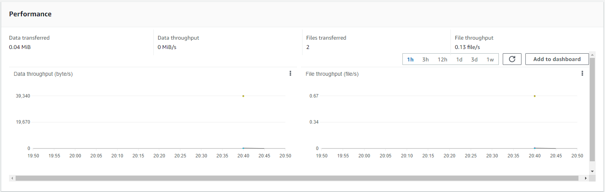
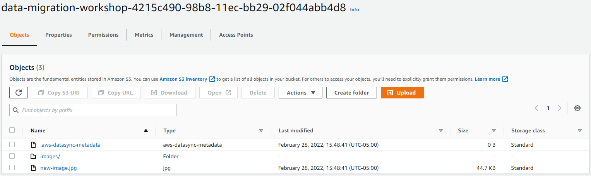
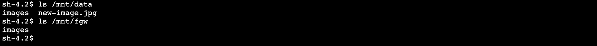
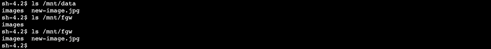

# Module 4 : 컷오버 전 마지막 증분 복제

이 모듈에서는 DataSync를 사용하여 증분 데이터 전송을 수행합니다.<br>
이렇게하면 초기 데이터 복사 후 생성된 새 파일을 가져올 수 있고, On-premises NFS 서버에서의 모든 파일이 복사 되었음이 확인되면 컷오버를 진행할 수 있습니다.



### Module Steps
👉🏻*Storage 모든 실습을 us-east-1: US East(N. Virginia)에서 진행합니다.*
1. **Create a new file on the NFS server**<br>
Application 서버용 CLI에서 다음 명령을 실행하여 NFS 서버에 새 파일을 생성합니다.
```
sudo cp /mnt/data/images/00001.jpg /mnt/data/new-image.jpg
```

2. **Copy the new file to the S3 bucket**<br>
NFS 서버에서 S3 버킷으로 파일을 복사하는 DataSync 작업을 이미 생성했습니다. 새 파일을 복사하려면 작업을 다시 실행하면 됩니다. DataSync는 소스와 대상 간에 변경된 파일만 복사합니다.

   1. IN-CLOUD 리전 AWS 관리 콘솔로 돌아가서 **DataSync** 서비스로 이동합니다.
   2. 이전에 생성한 작업을 선택하고 **Start** 버튼과 **Start with defaults**을 클릭합니다.
   3. 기록 탭으로 이동하고 목록에서 최신 작업 실행을 선택합니다.

   

작업을 완료하는 데 몇 분 정도 걸리는데 작업이 완료되면 stats을 살펴보세요. 지난번과 똑같은 작업을 실행했지만 2개의 파일만 복사되었습니다(새 파일 및 새 파일이 포함된 폴더의 변경 사항).




S3 버킷을 살펴보면 예상대로 새 파일이 있음을 알 수 있습니다.



### Validation Step

S3 버킷에 새 파일이 있으면 Application 서버의 Storage Gateway share를 통해 볼 수 있어야 합니다. 한 번 확인해 보시죠!
```
s /mnt/data
ls /mnt/fgw
```


자.. 우리는 DataSync를 사용하여 NFS 서버에서 S3로 파일을 복사했고 Storage Gateway는 S3 버킷에 연결되어 있습니다. 그런데? Application 서버의 Storage Gateway 공유에서 파일을 볼 수 없는 이유는 무엇입니까?

이 경우 파일은 Storage Gateway 공유 자체를 통하지 않고 DataSync를 통해 S3 버킷에 기록되었습니다. Storage Gateway는 버킷에 새 객체가 있다는 것을 인식하지 못합니다. Application 서버에서 새 파일을 보려면 Storage Gateway에서 메타데이터 캐시를 새로 고쳐야 합니다.

IN-CLOUD 리전 관리 콘솔로 이동하여 **Storage Gateway** 서비스로 이동합니다. 페이지 왼쪽에서 **File shares**를 클릭하고 목록에서 NFS share를 선택합니다. **Actions** 버튼을 클릭하고 **Refresh cache**을 선택한 다음 **Start**를 클릭합니다.

이 경우에는 수백 개의 객체만 있는 버킷이 있으므로 새로 고침이 빠릅니다. 개체가 많은 큰 버킷에서는 캐시 새로 고침에 상당한 시간이 걸릴 수 있습니다. 새로 고침 범위를 줄이려면 API 또는 CLI를 사용하고 새로 고침을 특정 디렉터리로 제한할 수 있습니다. CloudWatch 이벤트를 사용하여 캐시 새로 고침이 완료되는 시기를 모니터링할 수도 있습니다.

Application 서버용 CLI로 돌아가서 "ls /mnt/fgw" 명령을 반복해 보면 아마도 이제 새 파일이 표시될 것 입니다.



### Module4 Summary

이 모듈에서는 컷오버 전에 새 파일을 NFS 서버에 추가했습니다. 그런 다음 DataSync 작업을 두 번째로 실행하여 파일 변경 사항을 선택하고 S3에 복사했습니다. 마지막으로 Refresh cache을 사용하여 S3에서 새 파일을 볼 수 있도록 Storage Gateway의 메타데이터를 업데이트했습니다.

NFS 서버에서 S3로 모든 데이터가 복사되었으므로 이제 컷오버를 수행할 준비가 되었습니다.

마지막 단계인 [Module5](../detail/module5.md)로 GoGo!👏

