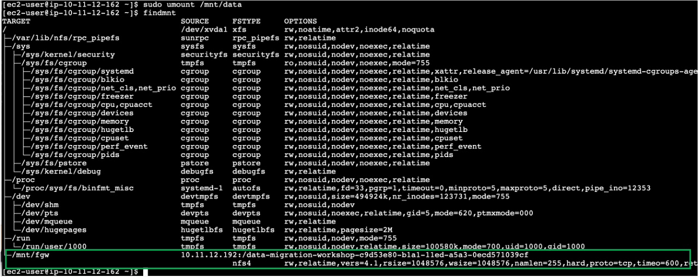
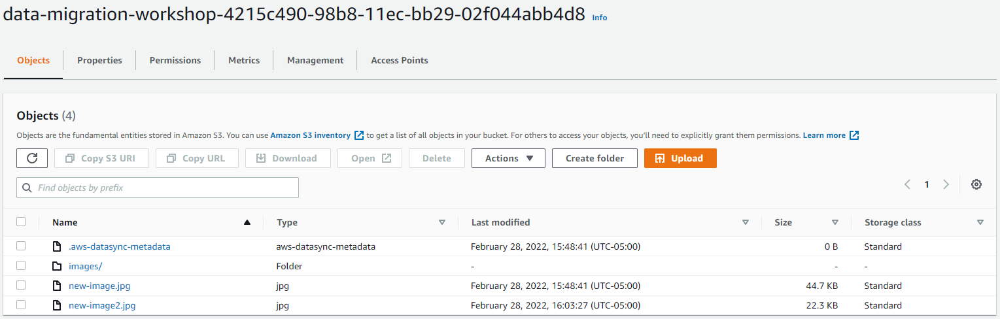
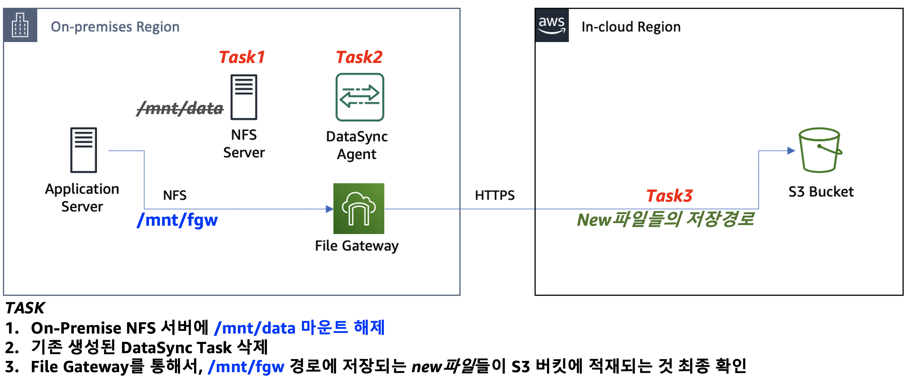

# Module 5 : Storage Gateway로 컷오버

S3 버킷에 모든 데이터가 있으므로 이제 NFS 서버를 종료하고 Storage Gateway만 사용하도록 전환할 준비가 되었습니다. 이 모듈에서는 NFS 서버를 마운트 해제하고 DataSync 리소스를 정리합니다. 그런 다음 Storage Gateway를 통해 일부 테스트 파일을 작성하여 S3 버킷에 저장되는지 확인합니다.


### Module Steps

👉🏻_Storage 모든 실습을 us-east-1: US East(N. Virginia)에서 진행합니다._

1. **Unmount the NFS server** Application 서버에서 CLI로 다음 명령을 실행하여 NFS 서버를 마운트 해제하십시오.

```
sudo umount /mnt/data
```

Application 서버에서 CLI로 다음 명령을 실행하여 현재 마운트 상황을 확인해 봅니다. Storage Gateway로의 접근 경로만 노출 된 것을 확인 합니다.

```
findmnt
```



2. **Clean up DataSync resources** DataSync를 완료했으므로 계속해서 리소스를 정리할 수 있습니다.
   1. AWS 관리 콘솔로 이동하여 DataSync 서비스로 이동합니다.
   2. Tasks를 선택하고 이전에 생성한 task를 삭제합니다.
   3. Locations을 선택하고 이전에 생성한 locations을 삭제합니다.
   4. Agents를 선택하고 이전에 활성화한 agent를 삭제합니다. 실제 DataSync agent가 설치된 EC2 instance는 삭제되지 않습니다. CloudFormation 스택이 삭제되면 나중에 함께 삭제됩니다.
   5. 자동 생성된 CloudWatch log group을 삭제합니다.

### Validation Step

Application 서버에서 CLI로 다음 명령을 실행하여 Storage Gateway를 통해 AWS S3 버킷에 또 다른 새로운 파일을 생성해 봅니다.

```
sudo cp /mnt/fgw/images/00002.jpg /mnt/fgw/new-image2.jpg
```

AWS 관리 콘솔로 돌아가서 AWS S3로 이동합니다. data-migration-workshop-xxxx-xxxx-xxxx 버킷을 선택 후 버킷에 new-image2.jpg 파일이 새롭게 표시되어야 합니다.



Application 서버가 컷오버를 완료 했습니다! 이제 Storage Gateway share를 사용하여 NFS 서버에 있던 모든 파일을 읽을 수 있습니다. 그리고 새로 마운트 된 /mnt/fgw/ 영역의 새로운 파일들은 자동으로 S3 버킷에 업로드됩니다. 이제 NFS 서버를 종료하고 폐기할 수 있습니다!



Storage Gateway 사용의 이점 중 하나는 파일을 S3에 완전하고 전체적으로 액세스 가능한 객체로 저장한다는 것입니다. 이제 S3의 데이터로 Amazon Athena, Amazon SageMaker, Amazon EMR 및 기타 많은 AWS 서비스를 사용하여 데이터를 통한 훨씬 더 큰 가치와 통찰력을 얻을 수 있습니다.

마지막 단계인 [Module6](broken-reference)로 GoGo!👏
