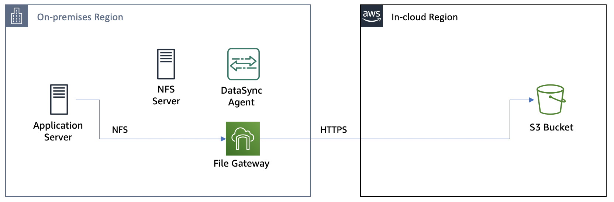

# Module 5 : Storage Gateway로 컷오버, NFS 서버 종료 및 워크샵 정리

S3 버킷에 모든 데이터가 있으므로 이제 NFS 서버를 종료하고 Storage Gateway만 사용하도록 전환할 준비가 되었습니다. 이 모듈에서는 NFS 서버를 마운트 해제하고 DataSync 리소스를 정리합니다. 그런 다음 Storage Gateway를 통해 일부 테스트 파일을 작성하여 S3 버킷에 저장되는지 확인합니다.<br>


### Module Steps (👉🏻*Storage 모든 실습을 us-east-1: US East(N. Virginia)에서 진행합니다.*)
***
1. **Unmount the NFS server**<br>
Application 서버의 CLI에서 다음 명령을 실행하여 NFS 서버를 마운트 해제하십시오.<br>
```
$ sudo umount /mnt/data
```
2. **Clean up DataSync resources**<br>
DataSync를 완료했으므로 계속해서 리소스를 정리할 수 있습니다.<br>
    1. ..
    2. ..
    3. ..
    4. ..
    5. ..


.

### Validation Step
***
다음 명령을 실행하여 2 NFS shares에 동일한 파일 집합이 있는지 확인합니다.<br>
```
diff -qr /mnt/data /mnt/fgw
```
/mnt/fgw: .aws-datasync-metadata에 하나의 추가 파일만 표시되어야 합니다.<br>
이 파일은 작업이 실행될 때 S3 버킷의 DataSync에 의해 생성되었는데 다른 모든 파일은 동일하며 데이터가 오류 없이 DataSync에 의해 완전히 전송되었음을 나타냅니다.

### Module1 Summary
***
이 모듈에서는 성공적으로 Storage Gateway를 활성화하고 게이트웨이에 NFS 파일 공유를 생성했습니다.<br>
그런 다음 Application 서버에 공유를 탑재하고 온프레미스 NFS 서버의 파일이 S3 버킷에 올바르게 복사되었는지 확인했습니다.<br><br>
이 워크숍의 궁극적인 목표는 온프레미스 NFS 서버를 종료하고 스토리지 리소스를 확보하는 것인데, 프로덕션 환경에서 이것은 일반적으로 애플리케이션 서버가 새로운 스토리지로 전환될 때 일시적인 다운타임이 발생하는 "*cutover point*"을 포함하며 이 워크숍에서는 Storage Gateway NFS 공유입니다.<br>
그러나 일반적으로 마이그레이션이 발생하는 동안 또는 그 직후에 생성되는 새 파일이 있으므로 컷오버 전에 또 다른 증분 파일 복사가 필요합니다.<br><br>
다음 모듈에서는 Storage Gateway 공유로의 최종 컷오버 전에 증분 복사를 한 번 더 수행합니다.<br>

[Module4](../detail/module4.md)로 GoGo!👏

