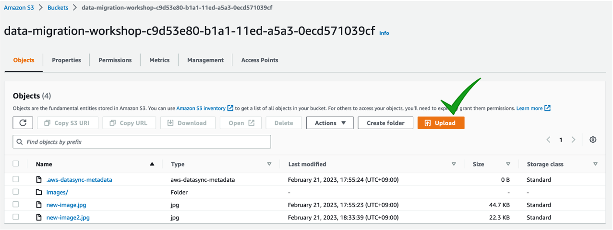

# S3 버킷에 객체 추가하기

앞선 과정을 통해 우리는 S3버킷을 생성하였기에 이제 또 다른 객체를 추가할 준비가 되어있습니다. 객체는 텍스트 파일, 사진, 비디오 등 모든 종류의 파일이 될 수 있습니다. Amazon S3에 파일을 추가할 때, 파일에 메타데이터를 포함하고 파일에 대한 액세스를 제어하는 권한을 설정할 수 있습니다.

1. \[Module6]S3에 대한 실습에서는 우리가 자동 생성했던 _data-migration-workshop-xxxx-xxxx_ 버킷에 7 장의 사진을 업로드 할 것입니다.\
   먼저 압축 파일을 다운로드 받고 로컬 하드 드라이브에 저장합니다. [photos.zip](https://static.us-east-1.prod.workshops.aws/public/0ca3d213-bb39-4eca-a878-30e322d3ab44/static/common/s3\_general\_lab/photos.zip)
2. 압축 파일을 보면 "photo1.jpg"부터 "photo7.jpg"까지 7개의 파일과 "V2" 폴더 아래에 "photo1.jpg" 이름을 가진 파일을 확인할 수 있습니다.
3. 생성한 버킷 페이지에서 "Objects" 탭에 있는 **Upload** 버튼을 클릭합니다.

4. 업로드할 파일을 선택하기 위해 Add Files 버튼을 클릭합니다. "photo1.jpg"부터 "photo7.jpg"까지 업로드합니다. 단, "V2" 폴더에 있는 "photo1.jpg" 파일은 업로드하지 않습니다. 해당 파일은 추후 실습에서 사용할 예정입니다.

5. 탐색기에서 이미지들을 선택한 후, 브라우저에 "Drag\&Drop" 작업을 수행하면 선택한 파일 리스트들이 화면과 같이 보입니다.

6. 아래쪽에 **Properties**를 클릭해보면 본 객체에 대한 **스토리지 클래스, 암호화, 태그, 메타데이터** 등을 설정할 수 있습니다. 사용 사례에 따라 다른 스토리지 클래스를 여기에서 선택할 수 있다는 것을 확인하고, 본 실습에서는 스탠다드 스토리지 클래스를 사용할 것이므로 다른 모든 설정은 기본값으로 둡니다. 페이지 맨 아래에 있는 Upload 버튼을 클릭합니다.

7. 업로드가 완료되면 위와 같이 "Upload succeeded"이 표시됩니다.

8. **Close**를 클릭하여 버킷 개요 페이지로 돌아갑니다. 이제 S3 객체가 된 7장의 사진을 버킷에서 모두 볼 수 있습니다.

지금까지 작업한 내용은 아래와 같습니다.(우측의 S3 영역 참조)

이제 다음 단계인 [AWS S3 콘솔에서 객체 작업하기](broken-reference) 이동해 볼까요?
